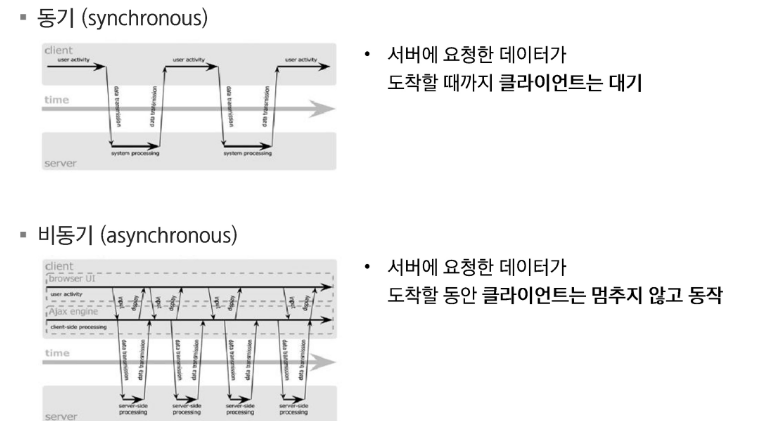
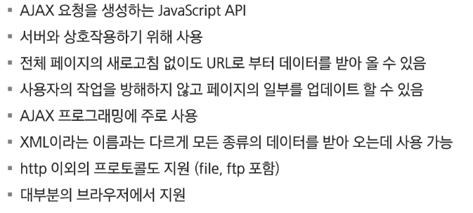
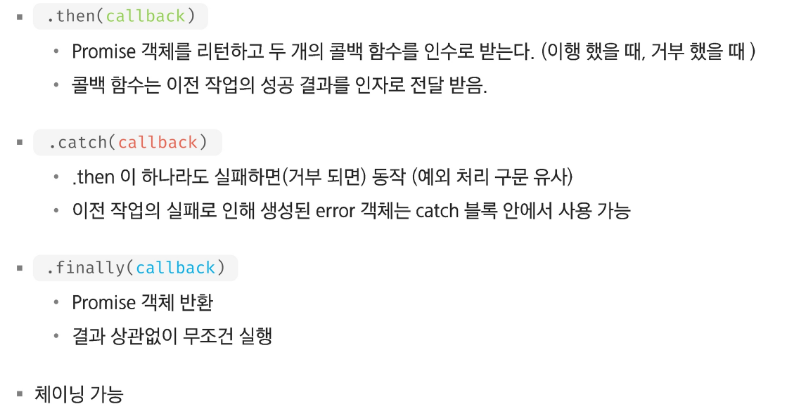
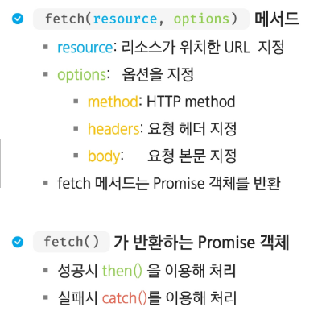

# Front

## AJAX

### AJAX

- 서버와 통신을 하기 위해서 XMLHttpRequest 객체를 활용
- JSON, XML, HTML 그리고 일반 텍스트 형식 등을 포함한 다양한 포맷을 주고 받을 수 있음
- 페이지 전체를 새로고침하지 않고서도 수행되는 "비동기성"

#### 동작방식

#### 순차적인 비동기 처리하기

- Web API로 들어오는 순서는 중요하지 않고, 어떤 이벤트가 먼저 처리되느냐가 중요

  1. Async Callback

  - 백그라운드에서 실행을 시작할 함수를 호출할 때 인자로 지정

  2. Promise Style

  - Modern Web APIs에서의 새로운 코드 스타일
  - XMLHttpRequest 객체를 사용하는 구조보다 조금 더 현대적인 버전

#### XMLHttpRequest 객체

---

### Promise

#### 콜백이란?

- 함수를 매개변수로 전달하여, 나중에 실행하도록 하는 것
- 콜백이 중첩되면, 콜백 헬이 되어 해석하고 유지보수하기 힘든 코드가 될 우려

#### Promise Object

- 비동기 작업을 마치 동기 작업처럼 값을 반환해서 사용 형태
- 미래의 완료 또는 실패와 그 결과 값을 나타냄
- 미래의 어떤 상황에 대한 약속

#### Promise Methods

---

### Fetch

- XMLHttpRequest보다 강력하고 유연한 조작이 가능
- Promise를 지원하므로 콜백 패턴에서 자유로움
  

---

### Appendix

#### async & await

- Promise를 더욱 편하게 사용할 수 있는 문법
- then 체이닝을 제거하고 비동기 코드를 동기 코드처럼 표현하는 방법

#### async

- function 앞에 위치
- 항상 Promise 반환

#### await

- await 키워드를 만나면 Promise가 처리될 때까지 기다린다.
