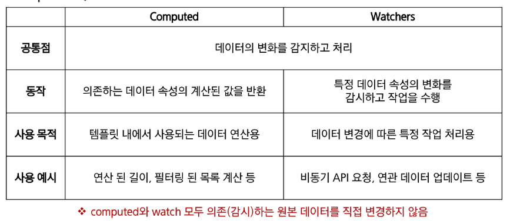
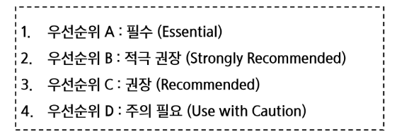
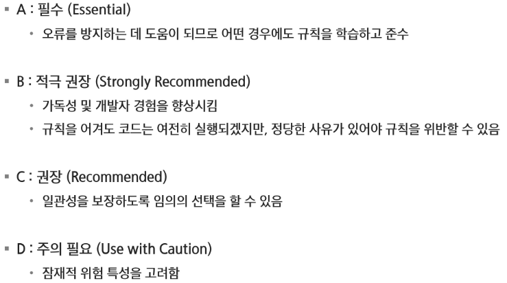

# Vue.js

## Vue Basic Syntax2

### Computed Properties

#### computed()

- 계산된 속성을 정의하는 함수 -> 미리 계산된 속성을 사용하여 템플릿에서 표현식을 단순하게 하고 불필요한 반복 연산을 줄임

#### computed 특징

- 반환되는 값은 computed ref 이며 일반 refs와 유사핳게 계산된 결과를 .value로 참조할 수 있음
- computed 속성은 의존된 반응형 데이터를 자동으로 추적

#### computed와 동일한 로직을 처리할 수 있는 method

- computed 속성 대신 method로도 동일한 기능을 정의할 수 있음
- 두 가지 접근 방식은 실제로 완전히 동일

#### computed와 method 차이

- computed 속성은 의존된 반응형 데이터를 기반으로 캐시된다
- method 호출은 다시 렌더링이 발생할 때마다 항상 함수를 실행

#### Cache

- 데이터나 결과를 일시적으로 저장해두는 임시 저장소
- 이후에 같은 데이터나 결과를 다시 계산하지 않고 빠르게 접근할 수 있도록 함

#### computed와 method의 적절한 사용처

- computed

  - 의존하는 데이터에 따라 결과가 바뀌는 계산된 속성을 만들 떄 유용
  - 의존된 데이터가 변경되면 자동으로 업데이트

- mothod
  - 단순히 특정 동작을 수행하는 함수를 정의할 때 사용
  - 의존 여부와 관계없이 항상 동일한 결과를 반환
  - 호출해야만 실행됨

---

### Conditional Rendering

#### v-if

- 표현식 값의 T/F를 기반으로 요소를 조건부로 렌더링

#### v-show

- 표현식 값의 T/F를 기반으로 요소의 가시성을 전환

#### v-if vs v-show

- 무언가를 매우 자주 전환해야 하는 경우에는 v-show를, 실행 중에 조건이 변경되지 않는 경우에는 v-if를 권장

---

### List Rendering

#### v-for

- 소스 데이터를 기반으로 요소 또는 템플릿 블록을 여러 번 렌더링

#### v-for with key

- 반드시 v-for와 key를 함께 사용한다

---

### Wathcers

#### watch 구조

- 반응형 데이터를 감시하고, 감시하는 데이터가 변경되면 콜백 함수를 호출
- variable: 감시하는 변수
- newValue: 감시하는 변수가 변화된 값, 콜백 함수의 첫번째 인자
- oldValue: 콜백 함수의 두번째 인자

#### Computed와 Watchers

---

### Lifecycle Hooks

#### Lifecycle Hooks

- Vue 인스턴스의 생애주기 동안 특정 시점에 실행되는 함수
- 개발자가 특정 단계에서 의도하는 로직이 실행될 수 있도록 함

---

### Vue Style Guide

