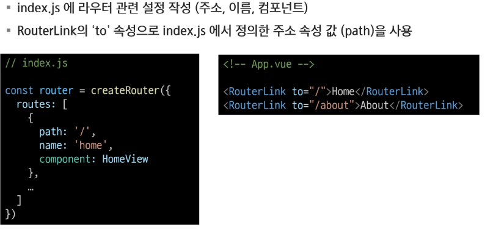
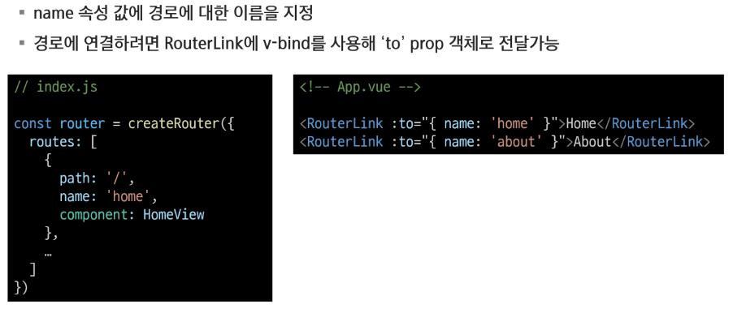
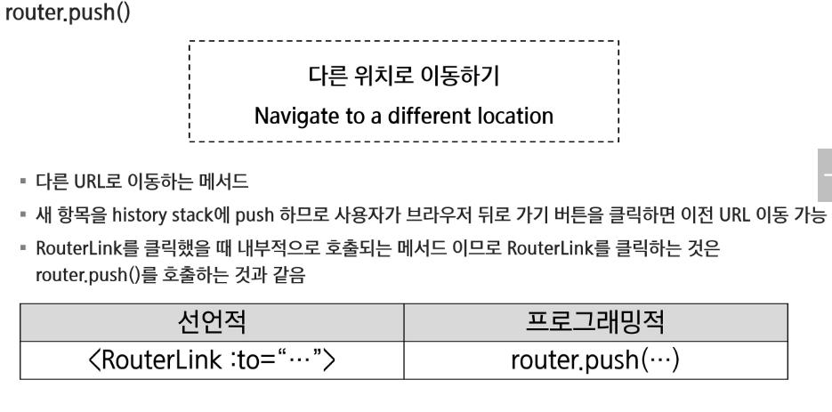
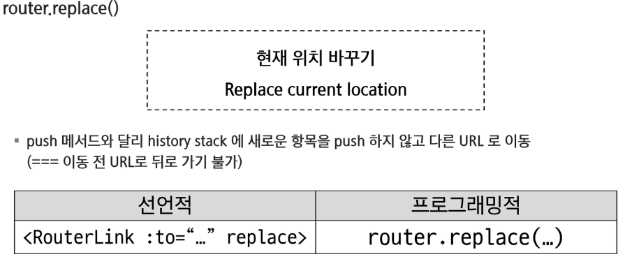

# Vue.js

## Router

### Routing

- 네트워크에서 경로를 선택하는 프로세스

#### SSR에서의 Routing

- 서버가 사용자가 방문한 URL 경로를 기반으로 응답을 전송
- 링크를 클릭하면 브라우저는 서버로부터 HTML 응답을 수신하고 새 HTML로 전체 페이지를 다시 로그

---

### Vue Router

#### RouterLink

- 페이지를 다시 로드하지 않고 URL을 변경하고 URL 생성 및 로직을 처리

#### RouterView

- URL에 해당하는 컴포넌트를 표시

#### 라우팅 기본

#### Named Routes

- 경로에 이름을 지정하는 라우팅

- 하드코딩된 URL을 사용하지 않아도 됨
- URL 입력 시 오타 방지

#### 프로그래밍 방식 네비게이션

- router의 인스턴스 메서드를 사용해 RouterLink로 a 태그를 만드는 것처럼 프로그래밍으로 네비게이션 관련 작업을 수행할 수 있음

1. 다른 위치로 이동하기 -> router.push()
2. 현재 위치 바꾸기 -> router.replace()

